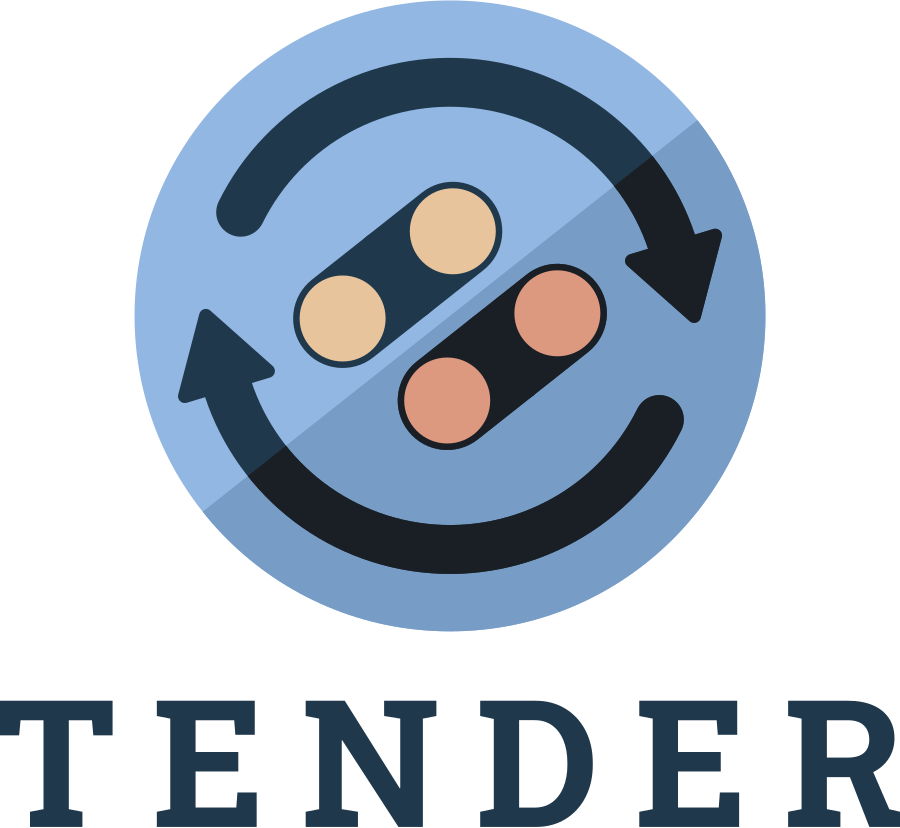

<div align="center">

<picture>
  <source media="(prefers-color-scheme: dark)" srcset="assets/lockup-dark.png">
  
</picture>

<h3>Your RomM library, running native in Steam — on RetroDECK or EmuDeck</h3>

[Getting Started](https://crimson3076.github.io/romm-dock/user-guide/getting-started/) ·
[Configuration](https://crimson3076.github.io/romm-dock/user-guide/configuration/) ·
[Syncing](https://crimson3076.github.io/romm-dock/user-guide/syncing-your-library/) ·
[Managing Games](https://crimson3076.github.io/romm-dock/user-guide/managing-games/)

[BIOS &amp; Cores](https://crimson3076.github.io/romm-dock/user-guide/bios-management/) ·
[Save Sync](https://crimson3076.github.io/romm-dock/user-guide/save-sync/) ·
[Troubleshooting](https://crimson3076.github.io/romm-dock/user-guide/troubleshooting/)

<a href="https://crimson3076.github.io/romm-dock/"></a>
<a href="https://github.com/Crimson3076/romm-dock/releases/latest"></a>
<a href="https://github.com/Crimson3076/romm-dock/stargazers"></a>
<a href="https://github.com/Crimson3076/romm-dock/releases"></a>
<a href="https://github.com/rommapp/romm/releases"></a>

</div>

> [!IMPORTANT]
> **RomM-Dock is an AI-generated application.** Nearly all of the code, and this documentation, was written by an AI
> coding agent (Claude), directed and reviewed by a human maintainer. See [Acknowledgments](#acknowledgments) below for
> the project's origin and the humans and projects behind it.

A [Decky Loader](https://decky.xyz/) plugin that syncs your self-hosted [RomM](https://github.com/rommapp/romm) library
into Steam as non-steam shortcuts. Games appear directly in your Steam library, keep their saves in sync across devices
through your RomM server, and launch through either [RetroDECK](https://retrodeck.net/) or
[EmuDeck](https://www.emudeck.com/) — whichever launcher backend you already use.

_RomM-Dock is a community fork of [Tender](https://github.com/danielcopper/romm-tender), rebranded and extended with
EmuDeck support. See [Acknowledgments](#acknowledgments) for full credit._

> **Pre-1.0 (v0.x).** The feature set isn't complete yet. Save sync covers standard cartridge saves; the memory-card
> systems — PlayStation, PS2, Dreamcast, GameCube, PSP, 3DS — don't sync their saves yet, and the
> [support matrix](https://crimson3076.github.io/romm-dock/user-guide/save-sync-support-matrix/) has the per-system
> detail. The [Decky Store](https://plugins.deckbrew.xyz/) listing comes with v1.0; until then it's a manual install.

---

> [!NOTE]
> **How this is built.** The code is written by an AI coding agent working under my direction. The architecture, the
> design decisions and the review are mine, and changes are smoke-tested on real hardware before they ship.

## Features

- **Library sync** — Pulls the platforms and collections you pick from your RomM server into Steam as non-steam
  shortcuts with RomM cover art; later runs are incremental and preview what will change before touching anything
- **SteamGridDB artwork** — Add a free [SteamGridDB](https://www.steamgriddb.com/) key to get hero banners, logos, wide
  capsules and custom icons, with a manual picker for games that don't match automatically
- **Save sync** — Opt-in save syncing across devices through your RomM server, automatically before launch and after you
  quit; identical saves resolve silently, and if both sides genuinely changed you decide which one wins
  ([not every system syncs yet](https://crimson3076.github.io/romm-dock/user-guide/save-sync-support-matrix/))
- **Save slots & version history** — Multiple named save profiles per game, plus per-file version history with restore
- **ROM downloads** — Download on demand with progress, pause/resume/cancel, and a managed queue
- **BIOS management** — Per-platform BIOS status, download all or only what your active core requires, hash-verified
  against a bundled registry, and delete them again when you're done
- **Game detail page** — Replaces Steam's page for synced games: RomM metadata, RetroAchievements progress, playtime,
  install and BIOS status, save management, and per-game actions
- **Multi-disc & multi-version** — Pick the disc for multi-disc games and switch between regions or revisions of the
  same game, right from its Steam page
- **Native-Windows games** — Windows-only titles launch straight through Proton, which the plugin finds and runs for
  you; pick which `.exe` to launch when an install has more than one
- **Emulator cores** — Set the core per system, or override it for a single game
- **Steam Input** — Pick a Steam Input mode (Default / Force On / Force Off) and apply it to every shortcut the plugin
  created
- **RetroArch input fix** — Spots the `input_driver` value that breaks controller navigation in RetroArch's menus and
  repairs it in one tap
- **RetroDECK or EmuDeck** — Pick the launcher backend you already use; emulator/core selection, launch commands, and
  file placement are scoped independently per backend
- **Follows RetroDECK moves** — Moved RetroDECK to another drive? The ROMs, BIOS files and saves the plugin manages are
  relocated and your shortcuts repointed — nothing needs re-downloading
- **Cleanup tools** — Remove shortcuts per platform or all at once, uninstall ROMs, and clear orphaned grid images

## Screenshots

|                Quick Access panel                |                    Game detail page                    |
| :----------------------------------------------: | :----------------------------------------------------: |
|  |  |
|               **BIOS management**                |                  **Per-game actions**                  |
|        |          |

## Requirements

- [Decky Loader](https://decky.xyz/) on your Steam Deck or Linux HTPC — the plugin lives in Steam's gamepad UI, so it
  works in the Deck's Game Mode **or** in Big Picture Mode on any Linux PC
- A running [RomM](https://github.com/rommapp/romm) server, **version 4.9.0 or newer** (the plugin stays inert against
  older servers)
- [RetroDECK](https://retrodeck.net/) or [EmuDeck](https://www.emudeck.com/) for launching games

## Installation

**Not on the Decky store.** The store doesn't accept plugins whose code is written with AI assistance, and RomM-Dock's is —
see _How this is built_ above. Install it from the URL below.

```text
https://github.com/Crimson3076/romm-dock/releases/latest/download/romm-dock.zip
```

<details open>
<summary><b>Install from URL</b> — the recommended way</summary>

Needs **Developer mode** in Decky Loader (Decky tab → gear icon → **General → Other** → toggle **Developer mode**).

1. Decky settings → **Developer** tab → **Install Plugin from URL**
2. Paste the URL above and install

That URL always resolves to the latest release. The [Decky Store](https://plugins.deckbrew.xyz/) listing comes with
v1.0; until then this is the way in.

</details>

<details>
<summary><b>Install from ZIP</b></summary>

Also needs **Developer mode**.

1. Download the latest `romm-dock.zip` from the [releases page](https://github.com/Crimson3076/romm-dock/releases)
2. In Decky settings → **Developer** tab → **Install Plugin from ZIP** (or **from URL** with the
   [latest release link](https://github.com/Crimson3076/romm-dock/releases/latest/download/romm-dock.zip))

</details>

> Full step-by-step instructions, including first-time setup, are in
> [Getting Started](https://crimson3076.github.io/romm-dock/user-guide/getting-started/).

## Quick start

1. Open the Quick Access Menu and select **RomM-Dock**
2. In **Settings**, enter your RomM server URL and credentials, then hit **Test Connection**
3. In **Platforms**, enable the platforms you want to sync
4. Open **Sync** and hit **Sync Library** — look over the changes it works out, then **Apply Sync**, and your ROMs
   appear as non-steam shortcuts

See the [User Guide](https://crimson3076.github.io/romm-dock/user-guide/syncing-your-library/) for syncing details,
[save sync](https://crimson3076.github.io/romm-dock/user-guide/save-sync/), and
[BIOS management](https://crimson3076.github.io/romm-dock/user-guide/bios-management/).

## Contributing

Build from source, run the tests, and read the architecture reference on the documentation site:

- [Development setup](https://crimson3076.github.io/romm-dock/contributing/development/)
- [Frontend dev loop](https://crimson3076.github.io/romm-dock/contributing/frontend-dev-loop/) — live-reload the UI into
  a windowed Big Picture on the Deck, no Game Mode switching
- [Backend architecture](https://crimson3076.github.io/romm-dock/architecture/backend-architecture/)

[](https://github.com/Crimson3076/romm-dock/actions/workflows/ci.yml)

## Acknowledgments

**RomM-Dock is an AI-generated application.** It was built by [Claude](https://claude.com/) (Anthropic's AI coding
agent), directed and reviewed by a human maintainer ([Crimson3076](https://github.com/Crimson3076)). Treat the code and
docs accordingly — they were written by an AI, under human direction and review, not hand-written by a human engineer.

RomM-Dock is a fork of [**Tender**](https://github.com/danielcopper/romm-tender) by
[danielcopper](https://github.com/danielcopper), rebranded and extended with EmuDeck launcher support alongside the
original RetroDECK support. All of Tender's original design and functionality carries forward — full credit to the
original project and author for the foundation this fork builds on.

This plugin also stands on the shoulders of other great projects:

- [RomM](https://github.com/rommapp/romm) — the self-hosted ROM manager at the heart of this plugin. RomM provides the
  library, metadata, cover art, and save file storage that makes the entire sync experience possible
- [RetroDECK](https://retrodeck.net/) — the all-in-one emulation solution for Steam Deck that bundles ES-DE, RetroArch,
  and standalone emulators into a single flatpak. One of the two launch chains this plugin supports runs through
  RetroDECK
- [EmuDeck](https://www.emudeck.com/) — the emulation setup and management tool for Steam Deck and Linux handhelds. The
  other launch chain this plugin supports runs through EmuDeck
- [Decky Loader](https://decky.xyz/) — the plugin framework that makes all of this possible
- [@decky/ui](https://github.com/SteamDeckHomebrew/decky-frontend-lib) — maintained by the Decky project, and how
  RomM-Dock reaches Steam's own interface components. It is not a component library: most of it is search predicates
  that find Steam's minified modules and hand them back, and keeping those working as Steam's output changes is real,
  continuous work that this project gets for free. RomM-Dock ships a copy of it — LGPL-2.1, see
  [THIRD-PARTY-NOTICES.md](THIRD-PARTY-NOTICES.md)
- [Valve](https://www.valvesoftware.com/) — for the Steam Deck, SteamOS, and an open enough platform to build on
- [Unifideck](https://github.com/ma3ke/unifideck) — inspiration for game detail page injection techniques and gamepad
  navigation patterns
- [MetaDeck](https://github.com/EmuDeck/MetaDeck) — inspiration for store patching patterns used in metadata display on
  non-Steam shortcuts
- [Argosy](https://github.com/rommapp/argosy-launcher) — RomM's Android device-sync client. Its baseline-anchored
  save-conflict handling — client-side detection layered over RomM's negotiate transport, with a keep-local/keep-remote
  prompt on genuine divergence — validated the posture this plugin's save sync takes
- [Grout](https://github.com/rommapp/grout) — RomM's Linux handheld client. Its 409-driven upload reconciliation (POST
  with overwrite=false, downgrading to a download when the local save is unchanged and surfacing a conflict when it
  diverged) informed this plugin's negotiate upload and conflict path

**Planned future integration:** [DualDeck](https://github.com/Crimson3076/DualDeck) — a Wii U/3DS/DS patch tool letting
a SteamOS/Bazzite client connect to a SteamOS/Bazzite host, using a Steam Deck as controller and second screen. DualDeck
is the maintainer's own separate project and is **not yet implemented** here — it's a planned direction, not a shipped
feature.

## License

GPL-3.0. This is an independent project and is not affiliated with, endorsed by, or sponsored by the RomM project,
RetroDECK, EmuDeck, or Valve Corporation.
